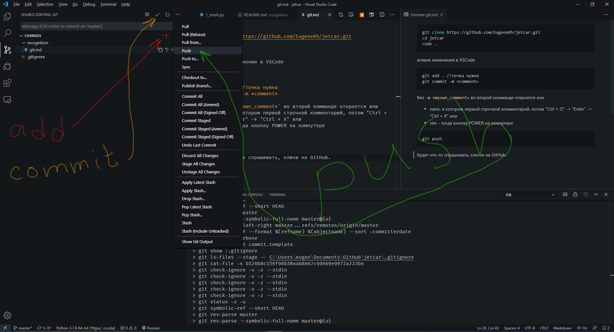

```bash
git clone https://github.com/EugeneKh/jetcar.git
cd jetcar
code .
```
всякие изменения в VSCode


```bash
git add . //точка нужна
git commit -m «comment»
```
без `-m «myown_comment»` во второй комманде откроется или
- nano, в котором первой строчкой комментарий, потом "Ctrl + O" -> "Enter" -> "Ctrl + X" или
- vim - тогда кнопку POWER на компутере

```bash
git push
```
будет что-то спрашивать, ключи на GitHub. 

можно (может и проще) прямо в VSCode

`Ctrl + Shift + G`

там окошко с авторизацией


